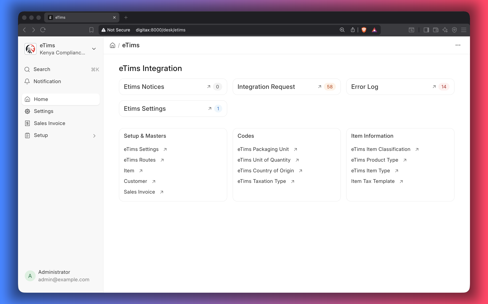

# Kenya Compliance via DigiTax

### [Documentation](https://docs.navari.co.ke/kenya-compliance-via-digitax/) - [DigiTax Docs](https://ke.docs.digitax.tech/)



Kenya Compliance via DigiTax is an integration application that connects ERPNext with the Kenya Revenue Authority (KRA) eTIMS platform through DigiTax, a certified middleware provider, using the Online Sales Control Unit (OSCU).

The application enables businesses to automatically transmit transactional data such as sales invoices, purchase records, and item information from ERPNext to KRA in compliance with Kenyan tax regulations. It embeds compliance directly into everyday business workflows, removing the need for manual reporting.

## Why This Integration Matters

The Electronic Tax Invoice Management System (eTIMS) is a mandatory system introduced by KRA requiring businesses to generate compliant invoices and submit transaction data to the tax authority.

Without automation, this process can be time-consuming, error-prone, and difficult to maintain consistently.

By integrating ERPNext with eTIMS via DigiTax, businesses benefit from:

- Regulatory compliance with KRA requirements
- Automated transmission of transaction data
- Improved accuracy in tax reporting
- Reduced manual intervention
- Better audit readiness and traceability

## How It Works

The integration operates seamlessly within ERPNext workflows.

When a transaction such as a Sales Invoice is created, the system prepares a compliant payload based on KRA requirements. This data is securely sent to DigiTax via API, which processes and forwards it to the eTIMS platform.

Once processed, a response is returned and stored in ERPNext. The transaction is updated with compliance status, QR codes, and reference details from KRA.

This entire process runs in the background with minimal user intervention.

## Key Capabilities

The application provides a full compliance layer within ERPNext, covering:

### Sales Invoice Submission

Automatic transmission of Sales Invoices (including returns/credit notes) to eTIMS as part of normal ERPNext workflows.

### Item and Customer Registration

Synchronization of product, customer, and inventory master data with eTIMS requirements.

### Compliance Tracking

Visibility into submission status, responses, and error logs directly within ERPNext.

### Error Handling and Retry

Built-in retry mechanisms for failed submissions without data loss.

---

## Role of DigiTax

DigiTax acts as the middleware layer between ERPNext and KRA eTIMS.

It is responsible for:

- Secure communication with KRA systems
- Data validation and transformation
- API compliance handling
- Routing transactions to eTIMS

Access to eTIMS through DigiTax requires prior onboarding and approval.

## Installation

### Manual Installation / Self Hosting

Before installing, ensure you have a working Frappe Bench environment with ERPNext installed.

Refer to the official setup guide:

- https://frappeframework.com/docs/user/en/installation

Fetch the application:

```bash
bench get-app https://github.com/navariltd/Kenya-Compliance-via-DigiTax.git
```

Install on your site:

```bash
bench --site <your.site.name.here> install-app kenya_compliance_via_digitax
```

Run migrations:

```bash
bench --site <your.site.name.here> migrate
```

## Running Tests

Enable testing:

```bash
bench --site <your.site.name.here> set-config allow_tests true
```

Run tests:

```bash
bench --site <your.site.name.here> run-tests --app kenya_compliance_via_digitax
```

Replace `<your.site.name.here>` with your ERPNext site name.

## Frappe Cloud Installation ☁️

The application can also be installed on Frappe Cloud after setting up a Bench and Site.

Steps:

1. Open your Bench
2. Go to **Apps**
3. Click **Add App**
4. Choose **Install from GitHub**
5. Provide the repository URL

## Important Note ⚠️

This integration relies on DigiTax as the middleware provider for communication with KRA eTIMS services.

Before production use, organizations must complete onboarding and credential provisioning through DigiTax.

### Support Contacts

- DigiTax Support: [support@namiri.tech](mailto:support@namiri.tech)
- Navari Support: [support@navari.co.ke](mailto:support@navari.co.ke)
- Website: [https://navari.co.ke](https://navari.co.ke)

## Contributing

This app uses `pre-commit` for code quality and formatting.

Install pre-commit:

```bash
pip install pre-commit
```

Enable it:

```bash
cd apps/kenya_compliance_via_digitax
pre-commit install
```

### Tools used:

- ruff
- eslint
- prettier
- pyupgrade

## License

This project is licensed under **AGPL-3.0**.

